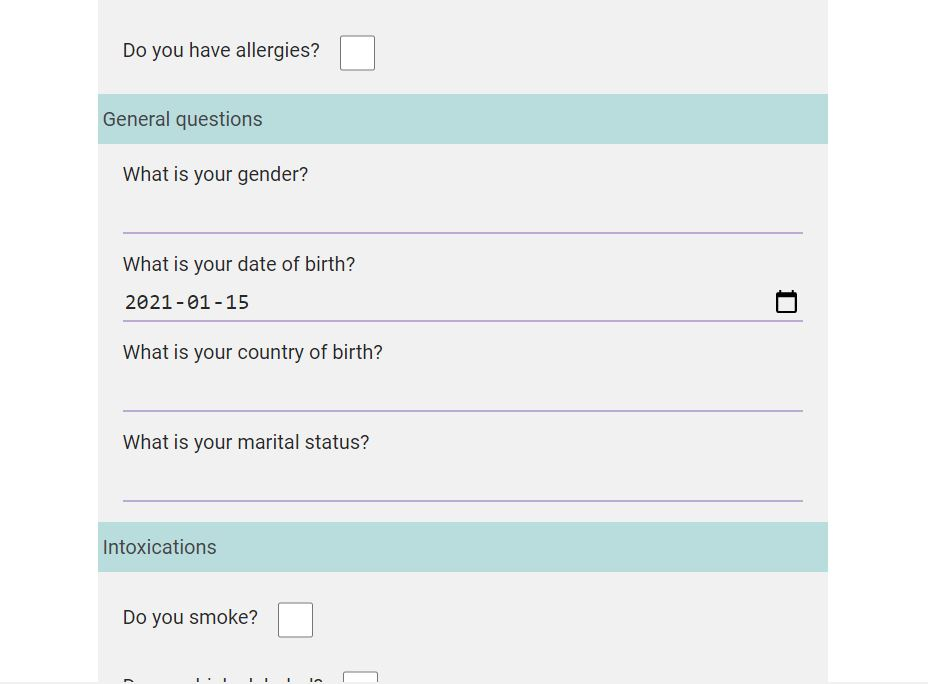

There will be 2 components having parent and child relation.

•	Parent will be having the questionnaire form with proper css and validation done
(more info about the form and data in the below sections)
1.	Select value
2.	US
3.	UK

•	Marital Status is a dropdown 
1.	Select Value
2.	Single
3.	Married
4.	Divorced

•	Once user submits the form Child component will be rendered with the results on the same screen below the submit button.

•	Service component will read the json from the asset folder

<h3 align="center"></h3>

